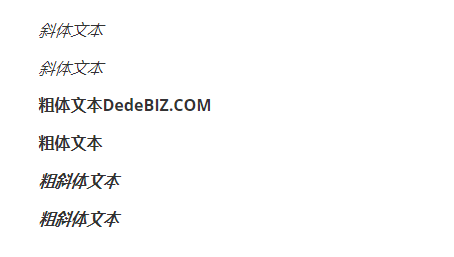
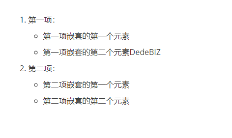
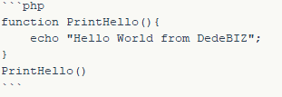
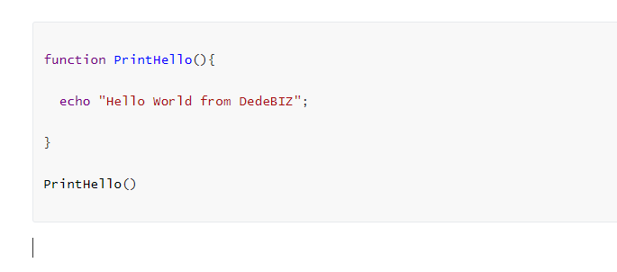
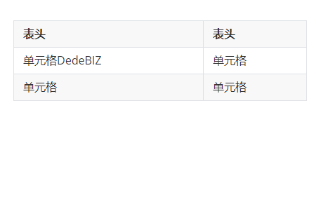
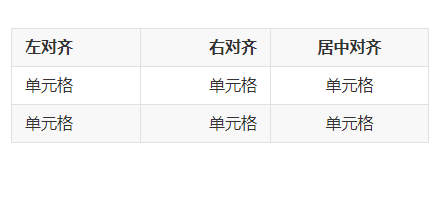

# Markdown说明文档

## Markdown标题
我们统一采用`#`来标记1-6级标题，数量代表级别，效果如下：
```
# 一级标题DedeBIZ.COM
## 二级标题DedeBIZ.COM
### 三级标题DedeBIZ.COM
#### 四级标题DedeBIZ.COM
##### 五级标题DedeBIZ.COM
###### 六级标题DedeBIZ.COM
```


## Markdown段落格式
段落的换行是使用两个以上空格加上回车，但DedeBIZ帮助中心一个回车就被解析成换行。两个回车就被解析成一个段落。

### 字体
```
*斜体文本*
_斜体文本_
**粗体文本DedeBIZ.COM**
__粗体文本__
***粗斜体文本***
___粗斜体文本___
```


### 分隔线
在一行中用三个以上的星号、减号、底线来建立一个分隔线，行内不能有其他东西。你也可以在星号或是减号中间插入空格。下面每种写法都可以建立分隔线：
```
***
DedeBIZ.COM
---
-------
```


### 删除线
文字的两端加上两个波浪线 `~~` 即可，实例：
```
DedeBIZ.COM
DedeCMS.COM
~~SOMEONE.COM~~
```


### 下划线
下划线可以通过 HTML 的 `<u>` 标签来实现：
```
不带下划线文本
<u>带下划线文本</u>
```


### 脚注
脚注是对文本的补充说明。
Markdown 脚注的格式如下:
```
[^要注明的文本]
```
例子：
```
创建脚注格式类似这样 [^DEDEBIZ]。
[^DEDEBIZ]: Dede商业 -- DedeCMSV6商业化支持站点
```


## Markdown列表
Markdown支持有序列表和无序列表。
无序列表使用星号`*`、加号`+`或是减号`-`作为列表标记，这些标记后面要添加一个空格，然后再填写内容：
```
* 第一项
* 第二项
* 第三项DedeBIZ.COM

+ 第一项
+ 第二项DedeBIZ.COM
+ 第三项

- 第一项DedeBIZ.COM
- 第二项
- 第三项
```
显示结果如下：

有序列表使用数字并加上`.`号来表示，如：
```
1. 第一项
2. 第二项DedeBIZ.COM
3. 第三项
```


### 列表嵌套
列表嵌套只需在子列表中的选项前面添加四个空格即可：
```
1. 第一项：
    - 第一项嵌套的第一个元素
    - 第一项嵌套的第二个元素DedeBIZ
2. 第二项：
    - 第二项嵌套的第一个元素
    - 第二项嵌套的第二个元素
```


## Markdown区块
Markdown 区块引用是在段落开头使用`>`符号 ，然后后面紧跟一个空格符号：
```
> 区块引用
> DedeBIZ
> Dede商业站点管理
```
显示结果如下：

另外区块是可以嵌套的，一个`>`符号是最外层，两个`>`符号是第一层嵌套，以此类推：
```
> 最外层
> > 第一层嵌套DedeBIZ
> > > 第二层嵌套
```


### 区块中使用列表
区块中使用列表实例如下：
```
> 区块中使用列表
> 1. 第一项
> 2. 第二项
> + 第一项
> + 第二项
> + 第三项
```


### 列表中使用区块
如果要在列表项目内放进区块，那么就需要在`>`前添加四个空格的缩进。
区块中使用列表实例如下：
```
* 第一项
    > 菜鸟教程
    > 学的不仅是技术更是梦想
* 第二项
```
显示结果如下：


## Markdown代码
如果是段落上的一个函数或片段的代码可以用反引号把它包起来```，例如：
```
`dedeprint()` 函数
```


### 代码区块
可以用 <code>```</code> 包裹一段代码，并指定一种语言（也可以不指定）：
实例如下：



## Markdown链接
链接使用方法如下：
```
[链接名称](链接地址)
或者
<链接地址>
```
例如：
```
这是一个链接 [Dede商业](https://www.dedebiz.com)
```


## Markdown图片
Markdown 图片语法格式如下：
```


```
- 开头一个感叹号 !
- 接着一个方括号，里面放上图片的替代文字
- 接着一个普通括号，里面放上图片的网址，最后还可以用引号包住并加上选择性的 'title' 属性的文字。
示例
```


```


## Markdown表格
Markdown 制作表格使用`|`来分隔不同的单元格，使用`-`来分隔表头和其他行。
语法格式如下：
```
| 表头          | 表头   |
| ------------- | ------ |
| 单元格DedeBIZ | 单元格 |
| 单元格        | 单元格 |
```
结果如下：

对齐方式
我们可以设置表格的对齐方式：
`-:` 设置内容和标题栏居右对齐。
`:-` 设置内容和标题栏居左对齐。
`:-:` 设置内容和标题栏居中对齐。
```
| 左对齐 | 右对齐 | 居中对齐 |
| :----- | ----: | :----:  |
| 单元格 | 单元格 | 单元格  |
| 单元格 | 单元格 | 单元格  |
```


## Markdown扩展

### 支持的HTML元素
不在 Markdown 涵盖范围之内的标签，都可以直接在文档里面用 HTML。
目前支持的 HTML 元素有：`<kbd>` `<b>` `<i>` `<em>` `<sup>` `<sub>` `<br>`等 ，如：
```
使用 <kbd>Ctrl</kbd>+<kbd>Alt</kbd>+<kbd>Del</kbd> 重启电脑
```


### 转义
Markdown 使用了很多特殊符号来表示特定的意义，如果需要显示特定的符号则需要使用转义字符，Markdown 使用反斜杠转义特殊字符：
```
**文本加粗** 
\*\* 正常显示星号 \*\*
```