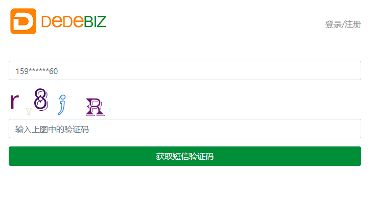
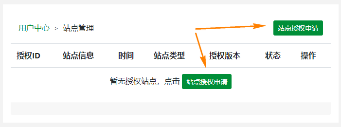
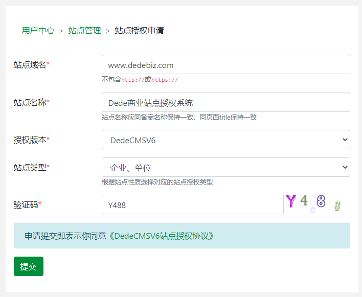
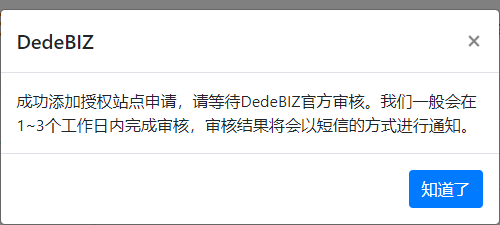
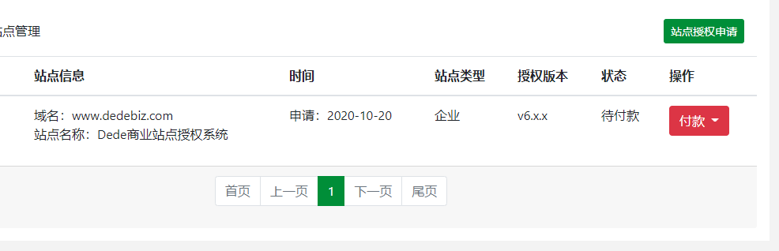
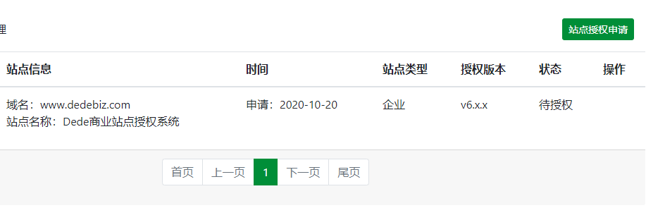
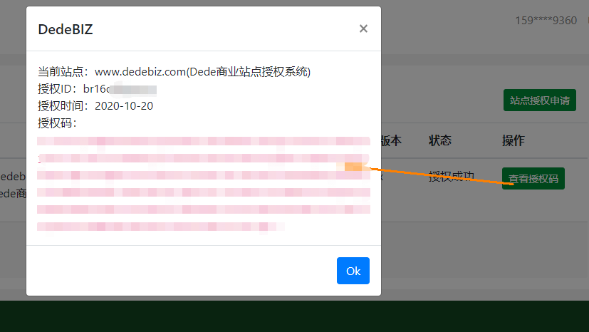
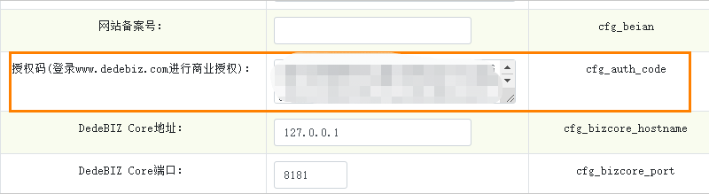
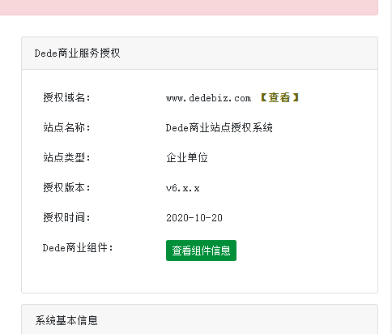

# DedeCMSV6商业授权申请
购买开源软件商业授权是对知识产权的一种尊重，同时也是为开源软件系统发展做出贡献，所有用户在使用DedeCMSV6系统之前应当仔细阅读[《DedeCMSV6站点授权协议》](/license)。文档将介绍如何通过DedeBIZ申请站点商业授权及享受DedeBIZ提供相关的软件服务。

## 注册、登录DedeBIZ
通过使用[手机号登录](/login?goto=/member/site_main)可方便快捷注册登录到DedeBIZ授权系统。

## 申请授权
点击`站点授权申请`按钮，进行授权申请。

根据表单提示，完成授权申请。

提交成功后将会提示等待DedeBIZ官方审核。

审核通过或者驳回后将会收到短信提示，根据提示信息再进行操作。

## 付款
站点审核通过后，登录[授权站点管理界面](/member/site_main)，选择对应的付款方式在线进行付款。

支付成功后等待DedeBIZ官方进行授权。

## 完成授权
授权成功后，我们可以点击查看对应的授权码。

打开DedeCMSV6系统，进入【系统】-【系统设置】-【系统基本参数】，在站点设置中，将复制的授权码，粘贴到`授权码(登录www.dedebiz.com进行商业授权)：	`参数选项中去。

这样我们就可以在系统后台页面看到授权信息。

