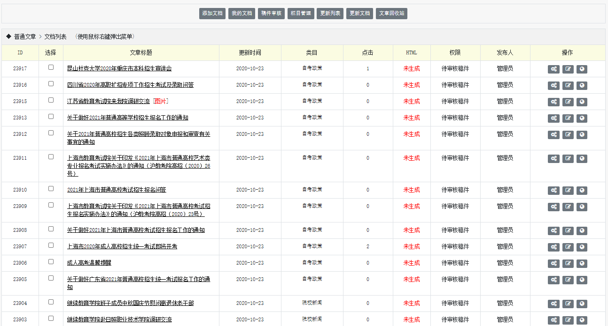
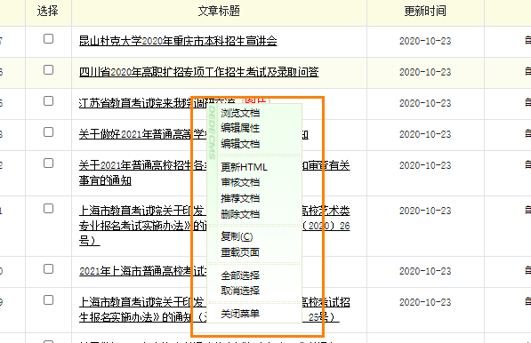
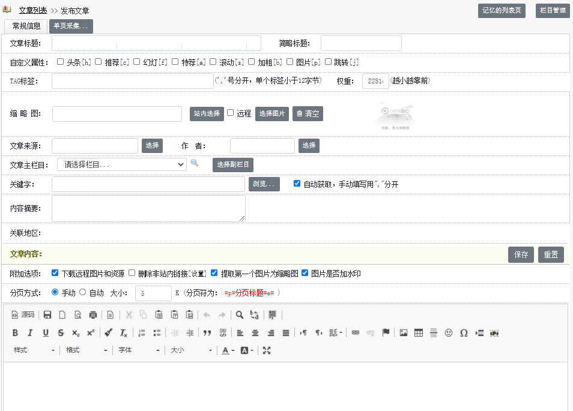
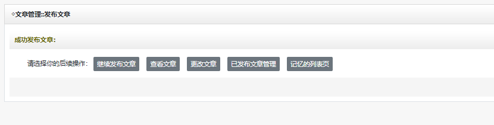
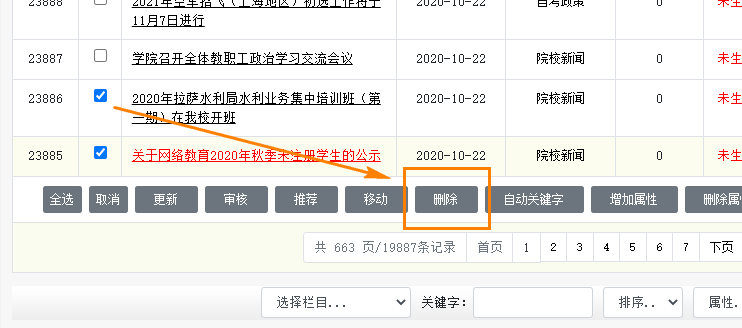

# DedeCMSV6内容发布
内容是一个站点的基础，DedeCMSV6系统中内容可以划分为以下几种：模型数据、文件内容、互动内容，其中我们用到最多的是模型数据，例如：文章、专题、商品、分类信息。

## 模型内容管理
我们在[栏目管理](quick_type.md)接触到了在创建栏目时候需要选定特定模型的概念，特定的栏目中只能发布特定模型的内容，我们对这些内容进行增加、编辑、删除等操作就是内容管理。

在系统后台【核心】-【内容管理】中我们可以看到我们的内容模型管理器选项，我们通过创建对应内容模型的栏目，就会出现相应的内容模型管理器。

我们以普通文章为例，在点击【内容管理】-【普通文章】后，系统操作页面会将所有普通文章模型的数据以分页的形式显示出来。

顶部快捷操作中有：

添加文档：新增当前内容模型下的内容，例如：普通文章

我的文档：列出我发布的内容

稿件审核：列出通过前台会员中心投稿的内容

栏目管理：跳转到栏目管理界面进行栏目管理

更新列表：用于生成当前栏目的静态HTML

更新文档：用于生成当前栏目内容的静态HTML

文章回收站：管理被软删除的文档

当然，在文档列表中某一个特定的内容右键单击，会弹出管理菜单。

也可以对选中的内容进行快捷操作。

## 添加内容
点击【内容管理】右键的快捷按钮，或者进入管理页面点击【添加文档】，就可以进入内容发布页面。

这里我们可以根据发布页面提示进行内容添加发布。

发布成功后，会显示发布成功提示框。

## 删除内容
我们在内容管理处右键，或者选择对应的内容记录，点击列表快捷操作栏中的删除，就可以对内容进行删除操作。

