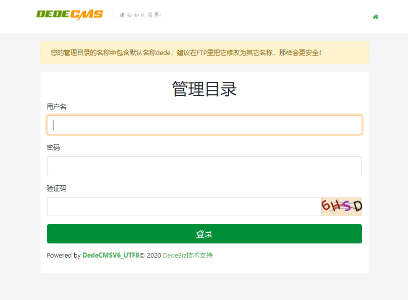
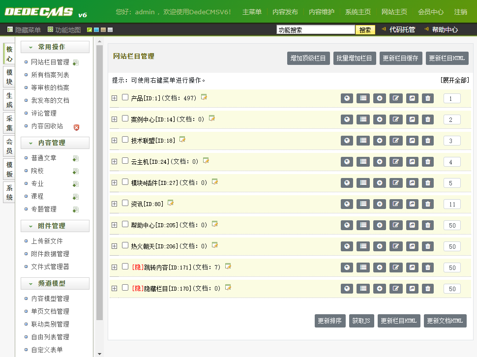
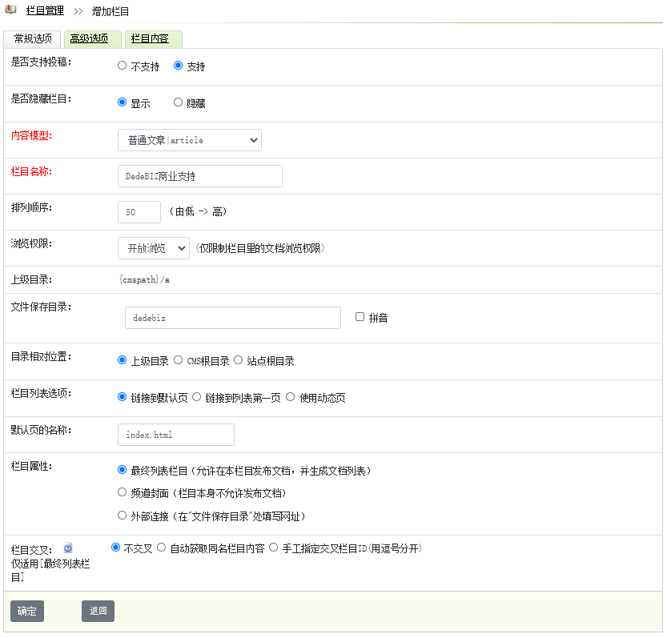
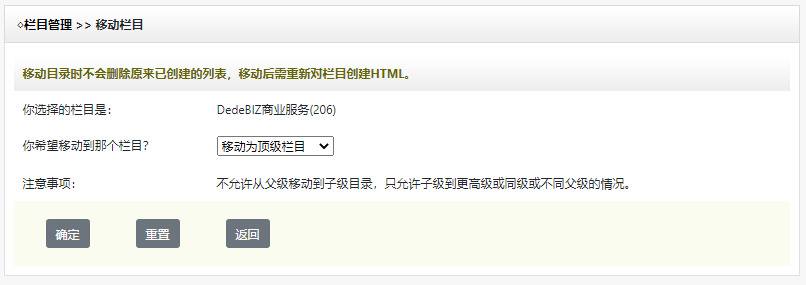
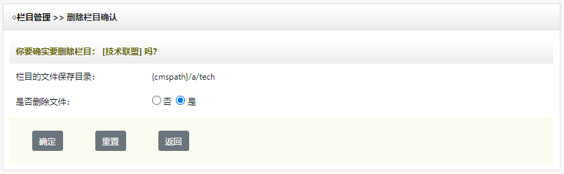

# DedeCMSV6栏目管理
在系统中，无限级的树型栏目结构贯穿了整个站点的搭建。正如《道德经》中所描述`一生二，二生三，三生万物`，站点的发展也是如此，我们需要先通过顶级栏目构建出我们整个媒体站点内容基础。

## 登录后台
我们在[安装DedeCMSV6系统](quick_download.md)中搭建了一个最基本的站点，我们通过访问`http://www.mydomain.com/dede`访问系统后台，当然我们建议生产环境中更改这个目录的名称或者绑定一个新的虚拟站点来独立访问后台。输入在安装时候配置的管理员账号、 密码。

## 添加栏目
在后台【核心】-【常用操作】-【网站栏目管理】中我们可以看到一个栏目管理界面。

通过按钮“增加顶级栏目”，我们来创建我们第一个栏目。

栏目选项卡分为以下几个部分：

常规选项：进行常用设置，例如选择内容模型、填写栏目名称、设置栏目排序、设置栏目保存的目录、及交叉栏目设置；

高级设置：启用多站点支持、栏目二级域名绑定、模板页的选择、栏目关键字和栏目描述设置、栏目及文章命名规则；

栏目内容：栏目内容是替代原来栏目单独页的更灵活的一种方式，可在栏目模板中用 {dede：field.content/}调用，通常用于企业简介之类的用途。

你也可以通过网站栏目管理处的【增加子类】操作来给网站顶级栏目添加子栏目，其具体信息同顶级栏目相似。

这里涉及到几个参数：

内容模型：频道的内容方式，你可以在后台的【频道管理】-【内容模型管理】处查看或者修改系统的已有内容模型，例如：普通文章、图片集、软件、商品等，一个栏目只允许有一种内容模型，以确定当前栏目的内容数据结构、模板；

排列顺序：数值越小，栏目顺序越靠前，排列顺序数值相同者ID数值越小则越靠前； 

栏目交叉：是指一个大栏目与另一个非下级的子栏目出现交叉的情况，相当于系统原来的副栏目功能，不过现在改在栏目里预先设置好。

多站点支持：开启多站点支持，可以给栏目绑定二级域名，例如：原来栏目地址为`https://www.dedebiz.com/news/`，你可以绑定二级域名`https://news.dedebiz.com`到这个目录是至成为子站点。

模板选择：可以给不同的频道(含列表及文章)设置不同的模板效果，可以在这里统一指定；

关键字及栏目描述：设置后出现在栏目前台页面顶部代码的<meta>中，类型有keywords和description，主要是针对搜索引擎进行设置；

## 编辑栏目
在栏目管理界面点击编辑按钮，可以对栏目进行修改，但修改之后原来的文件并不会随之移动。

编辑完后需要重新生成静态文件来看更新后的效果。

## 移动栏目
在栏目管理界面点击移动栏目按钮，可以对栏目进行移动。

## 删除栏目
在栏目管理界面点击删除栏目按钮，可以对栏目进行删除操作。

